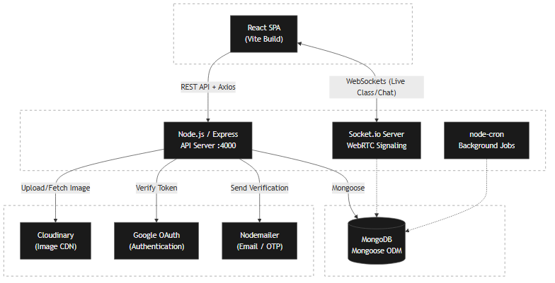

# Project1 - Virtual Classroom & Learning Management System

Project1 is a comprehensive Learning Management System (LMS) and Virtual Classroom application designed to facilitate real-time education, communication, and administration. It provides a robust platform for live classes, instant messaging, test management, and more.

## 🏗️ System Architecture




## 🚀 Tech Stack

- **Frontend:** React.js (powered by Vite), Tailwind CSS
- **Backend:** Node.js, Express.js
- **Database:** MongoDB (using Mongoose)
- **Real-time Communication:** Socket.io, WebRTC
- **Authentication:** JWT (JSON Web Tokens), Google OAuth

## ✨ Functionalities

- **Authentication & Authorization:** 
  - Secure user registration and login using JWT.
  - Seamless Google OAuth integration for quick access.
  - Role-based access control distinguishing regular Users and Admins.
- **Live Virtual Classrooms (WebRTC Implementation):** 
  - Real-time audio and video streaming is powered by **WebRTC** (Web Real-Time Communication) to provide low-latency peer-to-peer communication.
  - **Signaling:** `Socket.io` is utilized as the signaling server to exchange WebRTC session descriptions (offers and answers) and ICE (Interactive Connectivity Establishment) candidates between peers.
  - **Rooms:** Users can join dedicated live class rooms where their socket IDs are tracked to manage peer connections.
  - **Graceful Disconnects:** Automated cleanup of peer connections when users leave the class or disconnect.
- **Real-Time Communication:** 
  - Instant classroom group chats and direct messaging powered by **Socket.io**.
  - Online user status visibility.
- **User & Admin Management:** 
  - Profile customization and management.
  - Admin dashboard for overseeing users, classes, and system activities.
- **Assessments & Tests:** 
  - Creation, management, and participation in online tests.
- **Announcements:** 
  - System-wide and classroom-specific announcements to keep users informed.
- **Scheduling System:** 
  - Class and event scheduling.
  - Automated background jobs (cron) for schedule cleanup and maintenance.
- **Media Management:** 
  - Cloud-based storage for user avatars and shared media.

## 📦 Libraries Used

### Frontend Dependencies
- **[`react`](https://react.dev/) / [`react-dom`](https://react.dev/)**: Core libraries for building user interfaces.
- **[`react-router-dom`](https://reactrouter.com/)**: For client-side application routing.
- **[`tailwindcss`](https://tailwindcss.com/)**: Utility-first CSS framework for rapid UI styling.
- **[`axios`](https://axios-http.com/)**: Promise-based HTTP client for making API requests.
- **[`socket.io-client`](https://socket.io/)**: Client-side library for real-time bidirectional communication.
- **[`@react-oauth/google`](https://github.com/MomenSherif/react-oauth)**: Google OAuth integration for React.
- **[`lucide-react`](https://lucide.dev/)**: Clean and modern SVG iconography.
- **[`react-toastify`](https://fkhadra.github.io/react-toastify/)**: Elegant toast notifications for user feedback.

### Backend Dependencies
- **[`express`](https://expressjs.com/)**: Fast, unopinionated web framework for Node.js.
- **[`mongoose`](https://mongoosejs.com/)**: Elegant MongoDB object modeling for Node.js.
- **[`socket.io`](https://socket.io/)**: Server-side engine for real-time communication.
- **[`jsonwebtoken`](https://github.com/auth0/node-jsonwebtoken)**: For generating and verifying authentication tokens.
- **[`bcryptjs`](https://github.com/dcodeIO/bcrypt.js)**: Password hashing and security.
- **[`passport`](https://www.passportjs.org/) / [`passport-google-oauth20`](https://www.passportjs.org/packages/passport-google-oauth20/)**: Authentication middleware for Node.js.
- **[`cloudinary`](https://cloudinary.com/)**: Cloud service for managing image and video uploads.
- **[`nodemailer`](https://nodemailer.com/)**: Module for sending automated emails (e.g., password resets, notifications).
- **[`node-cron`](https://github.com/node-cron/node-cron)**: Task scheduler for executing automated background jobs.
- **[`cors`](https://github.com/expressjs/cors)**: Middleware for enabling Cross-Origin Resource Sharing.
- **[`cookie-parser`](https://github.com/expressjs/cookie-parser)**: Middleware for parsing cookies attached to client requests.
- **[`dotenv`](https://github.com/motdotla/dotenv)**: Module to load environment variables from a `.env` file.

## ⚙️ How to Run Locally

### Prerequisites
- Node.js installed
- MongoDB instance (local or MongoDB Atlas)

### Setup Instructions

1. **Clone the repository** and navigate into it.
2. **Install Backend Dependencies:**
   ```bash
   npm install
   ```
3. **Install Frontend Dependencies:**
   ```bash
   cd frontend
   npm install
   ```
4. **Environment Variables:**
   - Create a `.env` file in the root backend directory.
   - Add necessary environment variables (e.g., `PORT`, `MONGO_URI`, `JWT_SECRET`, `CLOUDINARY_URL`, Google OAuth credentials).
5. **Start the Application:**
   - Run the backend development server (from the root directory):
     ```bash
     npm run dev
     ```
   - Run the frontend development server (from the `frontend` directory):
     ```bash
     npm run dev
     ```
6. **Access the App:** Open `http://localhost:5173` in your browser.
